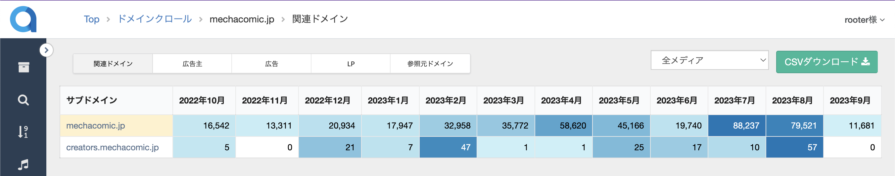

# color-scale.js

color-scale.jsは、エクセルの「カラースケール」機能をHTML上に適用できるJavaScriptです。

# 活用例

集計表のデータ分布に合わせて背景色を動的に変更することで、視覚的にデータ分布の傾向を理解しやすくなります。
おすすめの使い方や設定した方がいいオプションを[ブログ](https://rooter.jp/programming/javascript-color-scale/)にまとめています。

▼rooterでの活用例


# 使い方

```bash
git clone https://github.com/rooter-inc/color-scale
```

headタグに以下のスクリプトを追加することで適用されます。
```html
<script type="text/javascript" src="../color_scale/src/color_scale.js"></script>
<script type="text/javascript">
  window.addEventListener("load", function () {setColorScale({is_horizontal: true})});
</script>
```

# オプション

|   |型| デフォルト  | 説明 |
| ------------ |  ------------ | ------------ | ------------ |
| is_horizontal | boolean | false | カラースケールの方向を指定します。trueなら行方向、falseなら列方向。  |
| target_class  | string | "" | 適用したい`td`もしくは`th`のクラス名を指定します。デフォルトでは、html上のすべての`td`が対象です。|
| min_color  | string | #ff0000（赤)  | 最小値に対応する背景色を指定します。 |
| max_color  | string | #0000ff(青) | 最大値に対応する背景色を指定します。|
| zero_color  | string | #ffff00（黄) | 0に対応する背景色を指定します。 |
| null_color  | string | #ffffff(白) | 数値以外と0未満の数値に対応する背景色を指定します。 |
| interpolationColors | list | [] | 離散的に描画するための中間色を複数指定できます。 |

# 注意点

- 前提として`tr`、`td`で囲われた1セルに数値が入った集計表を対象としています。
- デフォルトでは、適用したhtml上のすべての`td`が色付け対象です。
- 0より大きい数値のみを有効な値とします。
- セル内のカンマは無視します。
